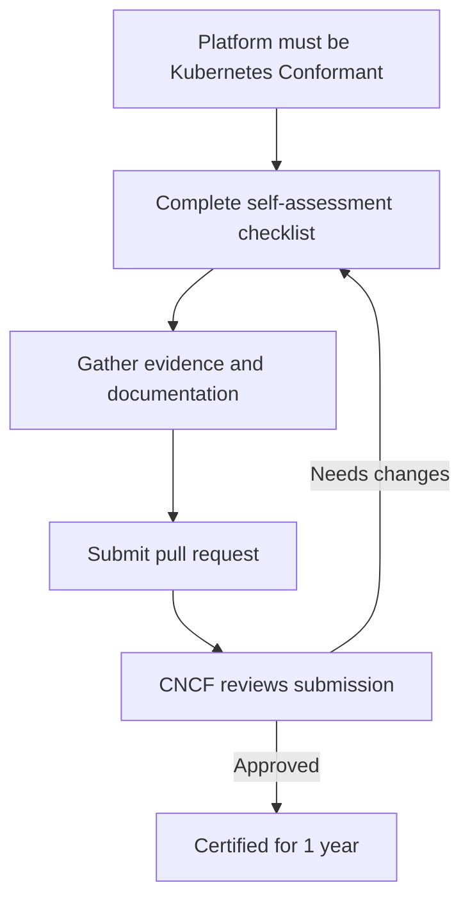

# Kubernetes AI Conformance

**A standardized approach to running AI/ML workloads on Kubernetes**

[Get Certified](#for-vendors) · [Contribute](#for-contributors) · [FAQ](faq.md) · [Working Group](https://github.com/kubernetes/community/tree/master/wg-ai-conformance)

If you're here to get certified, start at [For Vendors](#for-vendors). If you're here to help shape the program, jump to [For Contributors](#for-contributors).

---

## Table of Contents

- [What is this?](#what-is-this)
- [Getting Started](#getting-started)
  - [For Vendors](#for-vendors)
  - [For Contributors](#for-contributors)
- [How Certification Works](#how-certification-works)
- [Requirements Overview](#requirements-overview)
- [Resources](#resources)
- [Community](#community)

---

## What is this?

The Kubernetes AI Conformance Program defines the capabilities a Kubernetes platform needs to reliably run AI and machine learning workloads. The goal is simple: if your AI application works on one conformant platform, it should work on others too—with fewer "it works on my cluster" surprises.

### Why does this matter?

AI/ML workloads tend to stress clusters in unique ways (accelerators, bursty traffic, and strict isolation). Today, those capabilities vary across platforms. This program aims to:

- Make AI/ML workloads more portable across Kubernetes platforms
- Reduce platform-specific workarounds and "it works on my cluster" surprises
- Give the AI tooling ecosystem a clear baseline to build and test against

### What workloads does this cover?

We're focusing on the most common AI/ML use cases:

- **Training** - Distributed or large training jobs that need accelerators and predictable scheduling
- **Inference** - Model/LLM serving where latency, routing, and scaling matter
- **Agentic workloads** - Multi-step workflows that combine tools, memory, and long-running tasks

---

## Getting Started

### For Vendors

If you provide a Kubernetes platform and want to get certified, here's what you need to know.

Most submissions are a completed checklist plus links to public evidence—think of it as a structured, reviewable self-assessment.

**Before you start:** Your platform must already be [Kubernetes Conformant](https://github.com/cncf/k8s-conformance). AI conformance builds on top of base Kubernetes conformance.

#### The certification process

1. **Prepare** - Review the [certification requirements](terms-conditions/Certified_AI_Platform.md) and make sure your platform meets them
2. **Document** - Fill out the conformance checklist and gather evidence (documentation, test results, etc.)
3. **Submit** - Create a pull request with your submission
4. **Review** - CNCF reviews your submission (typically takes up to 10 business days)

#### What you'll need to submit

- A completed conformance checklist (YAML file)
- Public documentation showing how your platform meets each requirement
- Your product logo in vector format (SVG, EPS, or AI)
- Proof of Kubernetes conformance

**Note:** Today, certification is based on self-assessment. Automated conformance tests are planned for 2026.

For detailed instructions, see [instructions.md](instructions.md).

---

### For Contributors

You don't need to be a vendor to help shape this standard. The program is being developed in the open by the Kubernetes community.

#### Ways to contribute

| Area | What you can do |
|------|----------------|
| **Documentation** | Help improve guides, add examples, fix typos, clarify confusing parts |
| **Research** | Identify requirements for new AI workload types (especially agentic workloads) |
| **Testing** | Help develop automated conformance tests |
| **Discussion** | Participate in working group meetings and design discussions |

#### How to get involved

1. Join the [WG AI Conformance](https://github.com/kubernetes/community/tree/master/wg-ai-conformance) working group
2. Check out the [planning document](https://docs.google.com/document/d/1hXoSdh9FEs13Yde8DivCYjjXyxa7j4J8erjZPEGWuzc/edit?tab=t.0#heading=h.9j85ih1tpsk) to see what we're working on
3. Browse [open issues](https://github.com/cncf/k8s-ai-conformance/issues) or start a discussion

---

## How Certification Works

**Important notes:**

- Certifications are valid for one year and must be renewed
- Certification is per-product and per-configuration (e.g., cloud vs air-gapped)
- The conformance requirements are aligned with Kubernetes release cycles

---

## Requirements Overview

Platforms need to meet requirements across six areas:

| Category | What's required | Priority |
|----------|----------------|----------|
| **Accelerators** | Dynamic Resource Allocation (DRA), GPU sharing, driver management | MUST/SHOULD |
| **Networking** | Gateway API support for inference traffic routing | MUST |
| **Scheduling** | Gang scheduling, cluster and pod autoscaling | MUST |
| **Observability** | Metrics for accelerators and AI services | MUST |
| **Security** | Isolated and secure accelerator access | MUST |
| **Operators** | Support for complex AI operators like Ray or Kubeflow | MUST |

For the complete list of requirements, see the conformance checklists in the [docs/](docs/) directory.

---

## Resources

### Documentation

- [FAQ](faq.md) - Common questions about the program
- [Instructions](instructions.md) - How to prepare and submit your conformance results
- [Terms & Conditions](terms-conditions/Certified_AI_Platform.md) - Legal requirements for certification

### Conformance Checklists

Pick the one that matches your Kubernetes version:

- [AIConformance-1.35.yaml](docs/AIConformance-1.35.yaml) (latest)
- [AIConformance-1.34.yaml](docs/AIConformance-1.34.yaml)
- [AIConformance-1.33.yaml](docs/AIConformance-1.33.yaml)

### Related Projects

- [Kubernetes Conformance](https://github.com/cncf/k8s-conformance) - Base Kubernetes certification (required first)
- [Conformance Tests](https://github.com/kubernetes/kubernetes/blob/master/test/conformance/testdata/conformance.yaml) - Kubernetes test suite
- [Verify Conformance Bot](https://github.com/kubernetes-sigs/verify-conformance) - Automation coming soon

---

## Community

### Working Group

The [WG AI Conformance](https://github.com/kubernetes/community/tree/master/wg-ai-conformance) working group governs this program and defines the conformance requirements.

- **Meetings:** Check the community calendar in the working group repo
- **Contact:** conformance@cncf.io

### Certified Platforms

See all certified platforms in the version directories:
- [v1.35/](v1.35/)
- [v1.34/](v1.34/)
- [v1.33/](v1.33/)

### Need Help?

- Read the [FAQ](faq.md) first
- Ask questions in the working group
- [Open an issue](https://github.com/cncf/k8s-ai-conformance/issues)
- Email conformance@cncf.io

For private review of unreleased products, contact conformance@cncf.io directly.

---

## License

Apache License 2.0 - see [LICENSE](LICENSE) for details.
