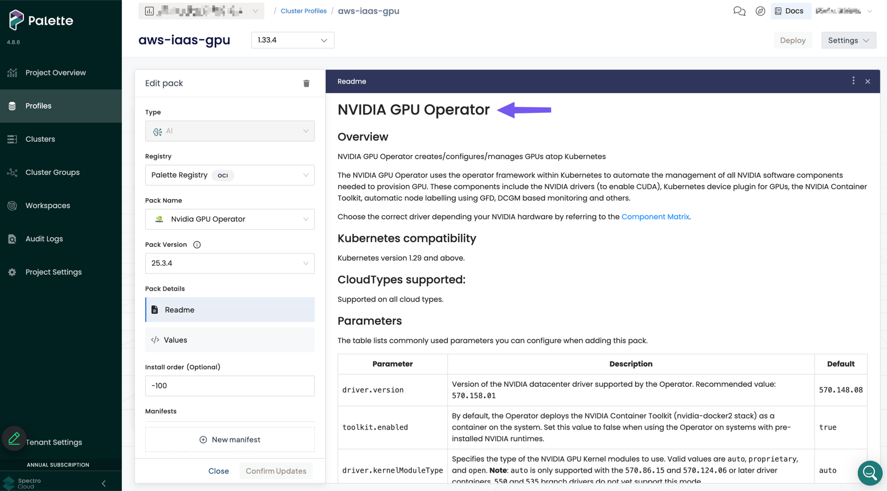
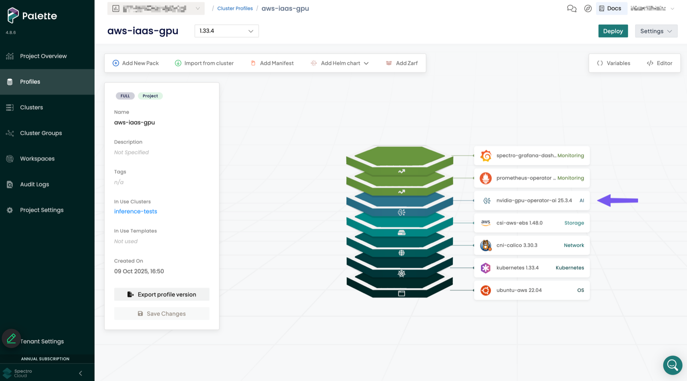
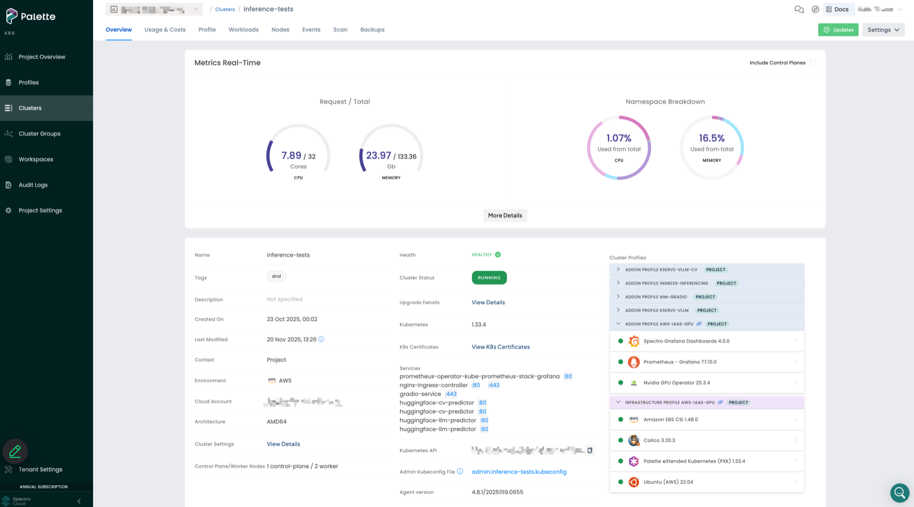

# Spectro Cloud Palette and PaletteAI Secure Accelerator Access

**MUST**: Ensure that access to accelerators from within containers is properly isolated and mediated by the Kubernetes resource management framework (device plugin or DRA) and container runtime, preventing unauthorized access or interference between workloads.

## Tests

### Test 1: Verify Isolated GPU Access via Device Plugin

**Step 1**: Prepare the test environment, including:

1. Create a [Cluster Profile](https://docs.spectrocloud.com/profiles/cluster-profiles/create-cluster-profiles/) in Palette
   1. Add the [NVIDIA GPU Operator Pack](https://docs.spectrocloud.com/integrations/packs/?pack=nvidia-gpu-operator-ai) to the cluster profile  
     
   
2. Create a Kubernetes v1.33 cluster
   1. 
3. Add a GPU node and observe that the NVIDIA device plugin gets installed by default by the NVIDIA GPU Operator

```bash
kubectl get pods -n gpu-operator
NAME                                                              READY   STATUS      RESTARTS   AGE
gpu-feature-discovery-khst8                                       1/1     Running     0          18d
gpu-feature-discovery-t4hxl                                       1/1     Running     0          15d
gpu-operator-7556ffc8fb-m597j                                     1/1     Running     0          31d
nvidia-container-toolkit-daemonset-72t8l                          1/1     Running     0          15d
nvidia-container-toolkit-daemonset-pbd9m                          1/1     Running     0          18d
nvidia-cuda-validator-67zww                                       0/1     Completed   0          15d
nvidia-cuda-validator-kzgzw                                       0/1     Completed   0          18d
nvidia-dcgm-exporter-blgmk                                        1/1     Running     0          18d
nvidia-dcgm-exporter-bm6nt                                        1/1     Running     0          15d
nvidia-device-plugin-daemonset-5sg2m                              1/1     Running     0          18d
nvidia-device-plugin-daemonset-czrg8                              1/1     Running     0          15d
nvidia-driver-daemonset-84hkz                                     1/1     Running     0          18d
nvidia-driver-daemonset-nl84r                                     1/1     Running     0          15d
nvidia-gpu-operator-ai-gpu-operator-node-feature-discoveryjth8c   1/1     Running     0          18d
nvidia-gpu-operator-ai-gpu-operator-node-feature-discoveryk8zb9   1/1     Running     0          31d
nvidia-gpu-operator-ai-gpu-operator-node-feature-discoveryqczck   1/1     Running     0          31d
nvidia-gpu-operator-ai-gpu-operator-node-feature-discoverysnzmp   1/1     Running     0          15d
nvidia-gpu-operator-ai-gpu-operator-node-feature-discoverytr7jp   1/1     Running     0          18d
nvidia-operator-validator-hl5k5                                   1/1     Running     0          18d
nvidia-operator-validator-tlwsv                                   1/1     Running     0          15d
```

**Step 2 [Accessible]**: Deploy a Pod on a node with available accelerator(s), and ensure the container within the Pod explicitly requests accelerator resources.

```bash
kubectl apply -f - <<EOF
apiVersion: v1
kind: Pod
metadata:
  name: ai-conformance-gpu-accessibility
  namespace: k8s-ai-conformance
spec:
  containers:
  - name: cuda-container
    image: nvcr.io/nvidia/k8s/cuda-sample:vectoradd-cuda12.5.0-ubuntu22.04
    command: ["sleep", "3600"]
    resources:
      limits:
        nvidia.com/gpu: 1
  restartPolicy: Never
  runtimeClassName: nvidia
EOF
```

Validate that the GPU is available:

```bash
kubectl exec ai-conformance-gpu-accessibility -n k8s-ai-conformance -- nvidia-smi -L
GPU 0: NVIDIA A10G (UUID: GPU-a669635e-6dfb-38a3-2f06-448166423d32)
```

**Expected Result**: The command should successfully return the GPU information.

**Step 3 [Isolation]**: Deploy two Pods on the same node, each requesting different GPU resources. Verify that only 1 pod is scheduled if only 1 GPU is available on the node OR that each pod only has access to the GPU it requested.

```bash
kubectl apply -f - <<EOF
apiVersion: v1
kind: Pod
metadata:
  name: ai-conformance-gpu-pod1
  namespace: k8s-ai-conformance
spec:
  containers:
  - name: cuda-container
    image: nvcr.io/nvidia/k8s/cuda-sample:vectoradd-cuda12.5.0-ubuntu22.04
    command: ["sleep", "3600"]
    resources:
      limits:
        nvidia.com/gpu: 1
    env:
    - name: CUDA_VISIBLE_DEVICES
      value: "0"
  restartPolicy: Never
  runtimeClassName: nvidia
EOF
```
Deploy a second workload with a GPU request:

```bash
kubectl apply -f - <<EOF
apiVersion: v1
kind: Pod
metadata:
  name: ai-conformance-gpu-pod2
  namespace: k8s-ai-conformance
spec:
  containers:
  - name: cuda-container
    image: nvcr.io/nvidia/k8s/cuda-sample:vectoradd-cuda12.5.0-ubuntu22.04
    command: ["sleep", "3600"]
    resources:
      limits:
        nvidia.com/gpu: 1
    env:
    - name: CUDA_VISIBLE_DEVICES
      value: "1"
  restartPolicy: Never
  runtimeClassName: nvidia
EOF
```

Verify isolation - each Pod should only see its allocated GPU:

```bash
kubectl exec ai-conformance-gpu-pod1 -n k8s-ai-conformance -- nvidia-smi -L
GPU 0: NVIDIA A10G (UUID: GPU-6e510464-243a-1e9c-874d-fe67c5be771a)
```

If only 1 GPU is available the second pod will not be scheduled.
```bash
kubectl describe pods ai-conformance-gpu-pod2 -n k8s-ai-conformance | awk '/^Events:/ {p=1; print; next} p'
Events:
  Type     Reason            Age                   From               Message
  ----     ------            ----                  ----               -------
  Warning  FailedScheduling  111s (x2 over 6m58s)  default-scheduler  0/3 nodes are available: 1 node(s) had untolerated taint {node-role.kubernetes.io/control-plane: }, 2 Insufficient nvidia.com/gpu. preemption: 0/3 nodes are available: 1 Preemption is not helpful for scheduling, 2 No preemption victims found for incoming pod.
```

If 2 GPUs are available on the node then the 2nd pod shows the GPU it has access to.
```bash
kubectl exec ai-conformance-gpu-pod2 -n k8s-ai-conformance -- nvidia-smi -L
GPU 0: NVIDIA A10G (UUID: GPU-00b9f588-b3c4-0cc5-b427-9a6f0ce00748)
```

**Expected Result**: Each Pod should only have access to its allocated GPU. The NVIDIA GPU Operator, through the `nvidia-device-plugin`, should ensure proper isolation between workloads.

### Test 2: Prevent Unauthorized Access

**Step 1**: Deploy a Pod without GPU resource requests and verify that it cannot access GPU devices directly.

```bash
kubectl apply -f - <<EOF
apiVersion: v1
kind: Pod
metadata:
  name: ai-conformance-gpu-accessibility-unauthorized
  namespace: k8s-ai-conformance
spec:
  containers:
  - name: cuda-container
    image: nvcr.io/nvidia/k8s/cuda-sample:vectoradd-cuda12.5.0-ubuntu22.04
    command: ["sleep", "3600"]
  restartPolicy: Never
EOF
```

When attempting to access GPU, this fails:

```bash
kubectl exec ai-conformance-gpu-accessibility-unauthorized -n k8s-ai-conformance -- nvidia-smi
error: Internal error occurred: Internal error occurred: error executing command in container: failed to exec in container: failed to start exec "68e12953061aad18a512f57ad366fc7ae82e3452e024143b149dc711205a842c": OCI runtime exec failed: exec failed: unable to start container process: exec: "nvidia-smi": executable file not found in $PATH
```

**Expected Result**: The Pod without GPU resource requests should not have access to GPU devices. The nvidia-smi command should fail, demonstrating that the NVIDIA GPU Operator, through the `nvidia-device-plugin`, properly mediates access.

**Step 2**: Verify that the container runtime has no GPU devices mounted, so it cannot bypass the device plugin by accessing GPU devices directly through device files.

```bash
kubectl exec ai-conformance-gpu-accessibility-unauthorized -n k8s-ai-conformance -- ls -la /dev/
total 4
drwxr-xr-x    5 root     root           360 Nov 23 18:36 .
drwxr-xr-x    1 root     root          4096 Nov 23 18:36 ..
lrwxrwxrwx    1 root     root            11 Nov 23 18:36 core -> /proc/kcore
lrwxrwxrwx    1 root     root            13 Nov 23 18:36 fd -> /proc/self/fd
crw-rw-rw-    1 root     root        1,   7 Nov 23 18:36 full
drwxrwxrwt    2 root     root            40 Nov 23 18:36 mqueue
crw-rw-rw-    1 root     root        1,   3 Nov 23 18:36 null
lrwxrwxrwx    1 root     root             8 Nov 23 18:36 ptmx -> pts/ptmx
drwxr-xr-x    2 root     root             0 Nov 23 18:36 pts
crw-rw-rw-    1 root     root        1,   8 Nov 23 18:36 random
drwxrwxrwt    2 root     root            40 Nov 23 18:36 shm
lrwxrwxrwx    1 root     root            15 Nov 23 18:36 stderr -> /proc/self/fd/2
lrwxrwxrwx    1 root     root            15 Nov 23 18:36 stdin -> /proc/self/fd/0
lrwxrwxrwx    1 root     root            15 Nov 23 18:36 stdout -> /proc/self/fd/1
-rw-rw-rw-    1 root     root             0 Nov 23 18:36 termination-log
crw-rw-rw-    1 root     root        5,   0 Nov 23 18:36 tty
crw-rw-rw-    1 root     root        1,   9 Nov 23 18:36 urandom
crw-rw-rw-    1 root     root        1,   5 Nov 23 18:36 zero
```

**Expected Result**: GPU device files should not exist in containers that don't request GPU resources through the Kubernetes resource management framework. These tests align with CNCF AI Conformance guidance for verifying device plugin isolation.
