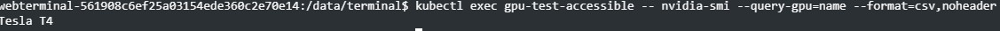
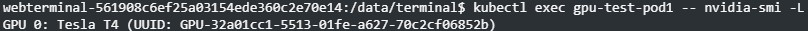
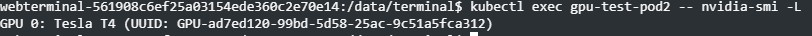
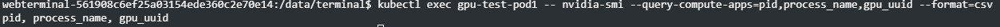
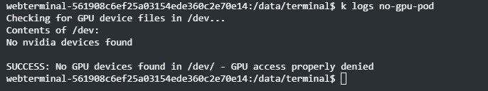

# Tests

## Prequisite

Create a Kubermatic User Cluster Kubernetes Version 1.34. 
Add a Machinedeployment with a Node with at least 2 GPUs

Add the NVIDIA GPU Operator Application

### Accessebility 

Deploy a Pod on a node with available accelerator(s), and ensure the container within the Pod explicitly requests accelerator resources. Inside the running container, execute a command to detect the accelerator device. This command should succeed and output the model of the accelerator device currently used by the container.

````yaml

apiVersion: v1
kind: Pod
metadata:
  name: gpu-test-accessible
  namespace: default
spec:
  containers:
  - name: cuda-container
    image: nvcr.io/nvidia/k8s/cuda-sample:vectoradd-cuda11.7.1-ubuntu20.04
    command: ["sleep", "3600"]
    resources:
      limits:
        nvidia.com/gpu: "1"
  restartPolicy: Never
  runtimeClassName: nvidia
  tolerations:
  - key: nvidia.com/gpu
    operator: Exists
    effect: NoSchedule

````
````shell
kubectl exec gpu-test-accessible -- nvidia-smi --query-gpu=name --format=csv,noheader
````
**Expected Result**: The command should successfully return the GPU model name, confirming that the container has proper access to the GPU through the device plugin framework.



#### Isolation

Deploy two Pods on the same node, each requesting different GPU resources (if multiple GPUs are available) or the same GPU with resource limits. Verify that each Pod can only access its allocated GPU resources and cannot interfere with the other Pod's GPU access.

````yaml

apiVersion: v1
kind: Pod
metadata:
  name: gpu-test-pod1
  namespace: default
spec:
  containers:
  - name: cuda-container
    image: nvcr.io/nvidia/k8s/cuda-sample:vectoradd-cuda11.7.1-ubuntu20.04
    command: ["sleep", "3600"]
    resources:
      limits:
        nvidia.com/gpu: "1"
    env:
    - name: CUDA_VISIBLE_DEVICES
      value: "0"
  restartPolicy: Never
  runtimeClassName: nvidia
  tolerations:
  - key: nvidia.com/gpu
    operator: Exists
    effect: NoSchedule
---

apiVersion: v1
kind: Pod
metadata:
  name: gpu-test-pod2
  namespace: default
spec:
  containers:
  - name: cuda-container
    image: nvcr.io/nvidia/k8s/cuda-sample:vectoradd-cuda11.7.1-ubuntu20.04
    command: ["sleep", "3600"]
    resources:
      limits:
        nvidia.com/gpu: "1"
    env:
    - name: CUDA_VISIBLE_DEVICES
      value: "1"
  restartPolicy: Never
  runtimeClassName: nvidia
  tolerations:
  - key: nvidia.com/gpu
    operator: Exists
    effect: NoSchedule

````

Verify isolation - each Pod should only see its allocated GPU

````shell
kubectl exec gpu-test-pod1 -- nvidia-smi -L
kubectl exec gpu-test-pod2 -- nvidia-smi -L
````




Verify that each Pod cannot access the other's GPU context
````shell
kubectl exec gpu-test-pod1 -- nvidia-smi --query-compute-apps=pid,process_name,gpu_uuid --format=csv
````



**Expected Result**: Each Pod should only see and be able to access its allocated GPU. The CUDA_VISIBLE_DEVICES environment variable and the device plugin should ensure proper isolation between workloads.

### Verify Unauthorized Access Prevention

A pod that does not request GPU resources must not be able to access GPUs
Creating pod without GPU resource request (but with affinity to guarantee GPU node placement)...

````yaml

apiVersion: v1
kind: Pod
metadata:
  name: no-gpu-pod
spec:
  restartPolicy: Never
  affinity:
    nodeAffinity:
      requiredDuringSchedulingIgnoredDuringExecution:
        nodeSelectorTerms:
        - matchExpressions:
          - key: nvidia.com/gpu.present
            operator: In
            values:
            - "true"
  containers:
  - name: test-container
    image: busybox:1.36
    command: ["/bin/sh", "-c"]
    args:
      - |
        echo "Checking for GPU device files in /dev..."
        echo "Contents of /dev:"
        ls -la /dev/ | grep -i nvidia || echo "No nvidia devices found"
        echo ""

        # Check if any nvidia device files exist
        if ls /dev/nvidia* 2>/dev/null; then
          echo "ERROR: GPU devices are accessible - found /dev/nvidia* devices!"
          echo "This pod should NOT have access to GPU devices."
          exit 1
        else
          echo "SUCCESS: No GPU devices found in /dev/ - GPU access properly denied"
          exit 0
        fi

````

````shell

kubectl get logs no-gpu-pod

````

**Expected Result**: GPU device files should not be available in containers that haven't requested GPU resources through the Kubernetes resource management framework.


